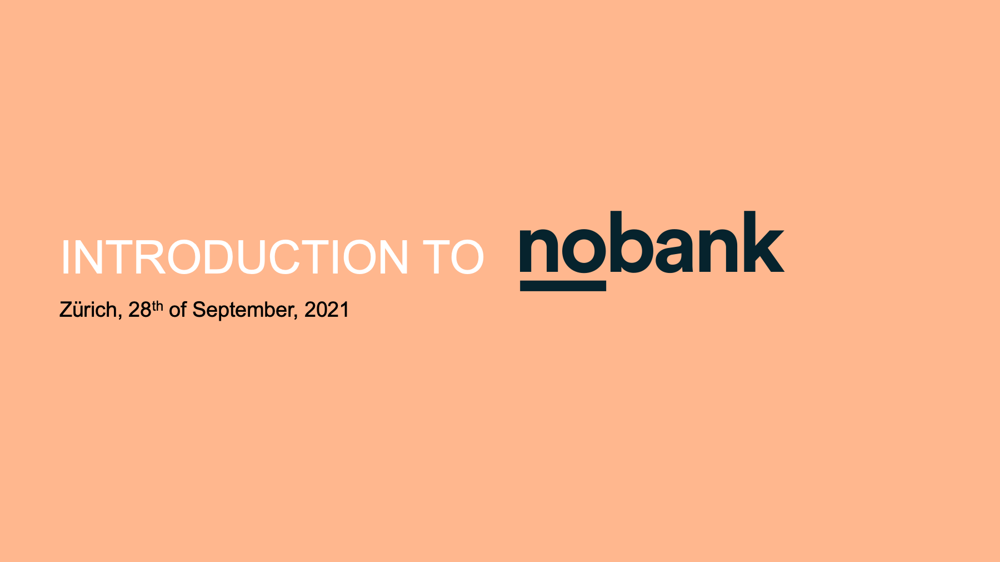
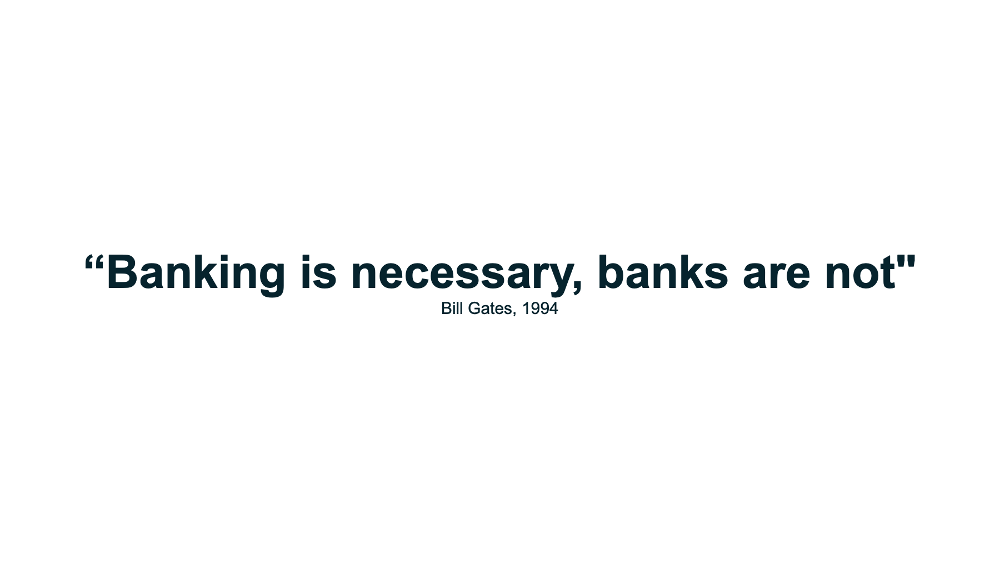
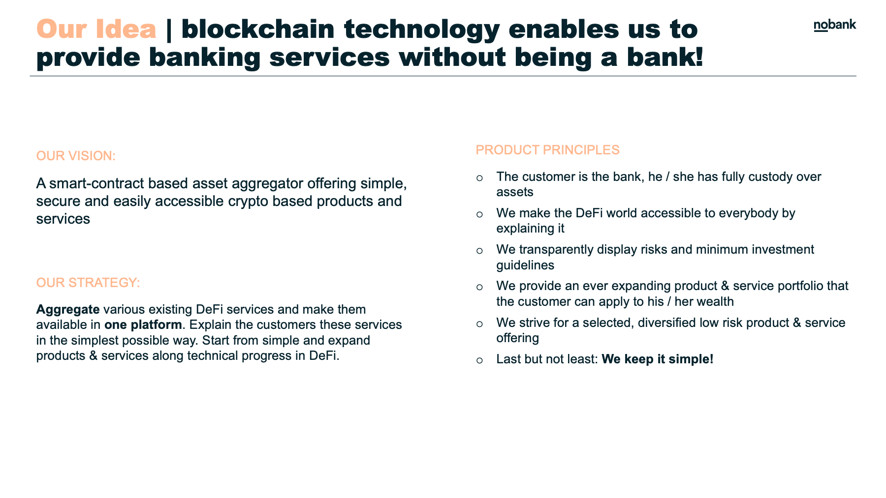
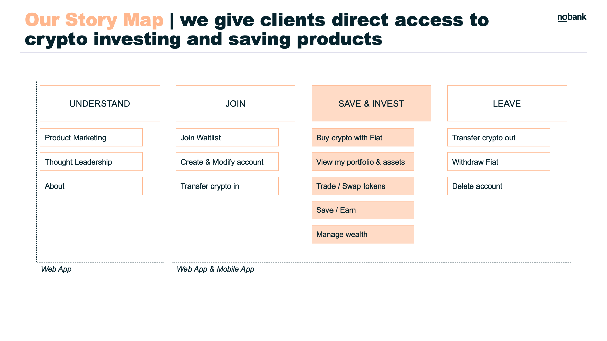
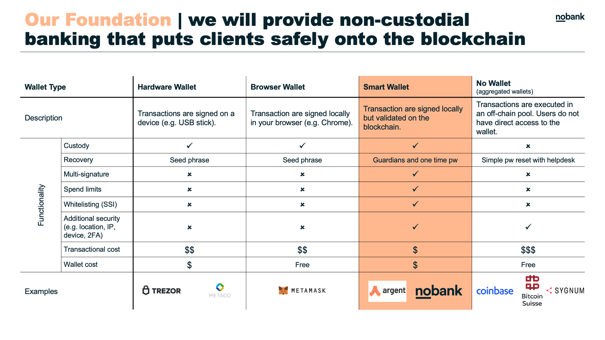
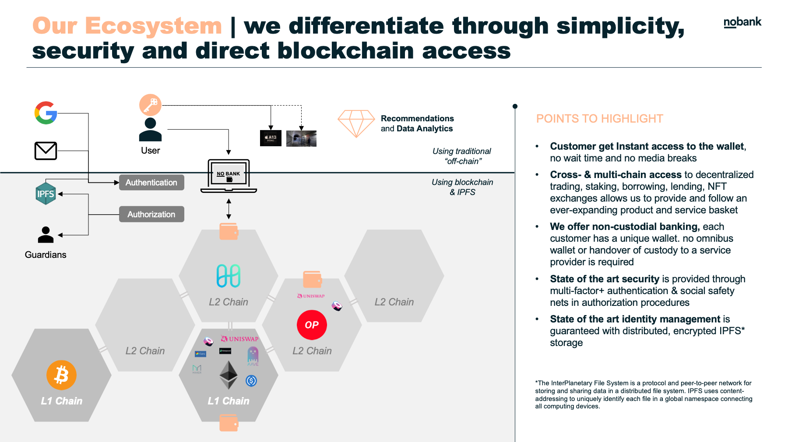
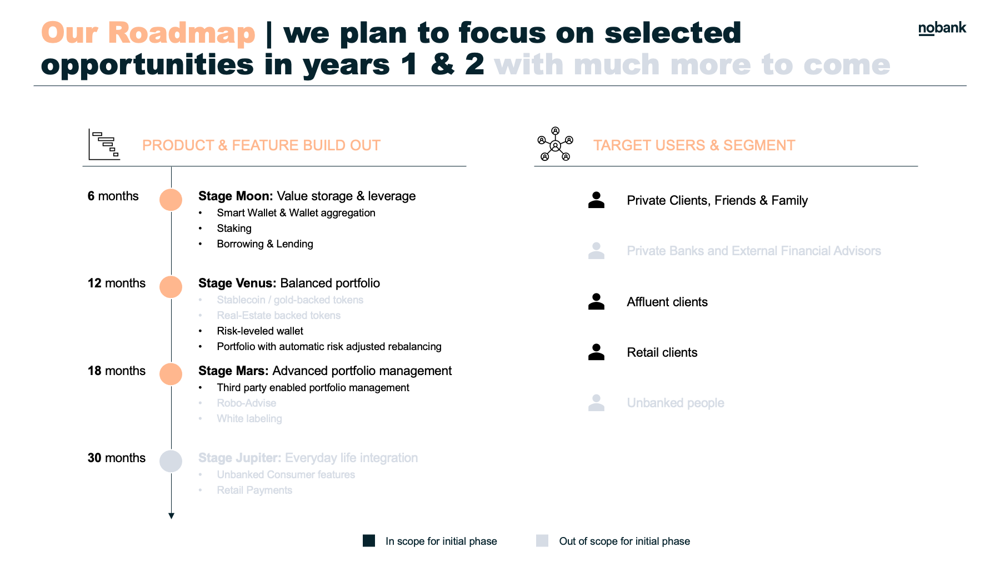
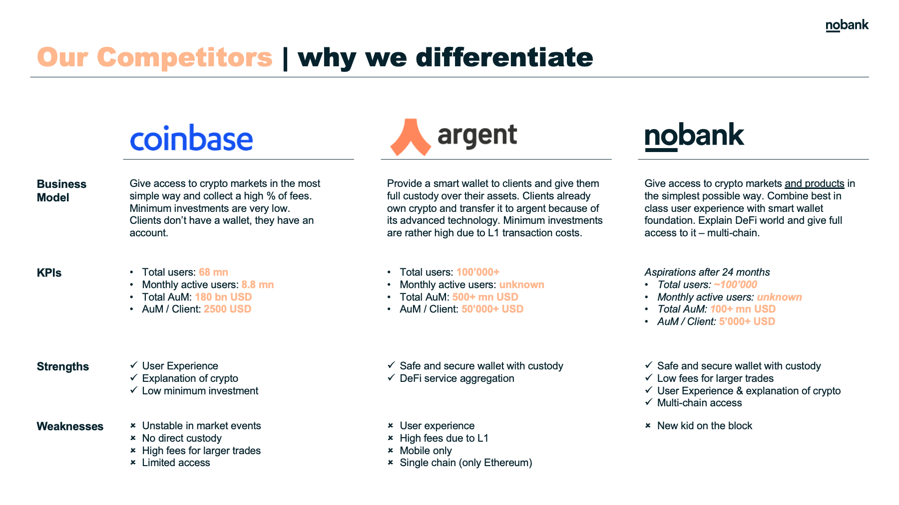
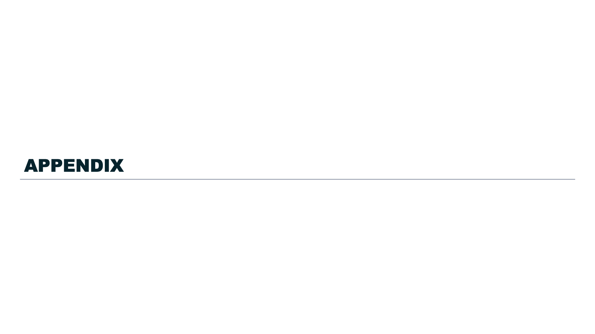

[**NoBank.Finance**](https://no-bank.finance) |
[**Overview**](#overview) |
[**Technical Features**](#key--technical--features)

### Intro

NoBank is a smart contract wallet designed with worry-free recovery using your Google Authenticator (no worry about key phrases, passwords, device loss, email phishing, sms hijacking), and with many advanced wallet features.

To learn more, watch our demo:

[**Link to Youtube video**](https://youtu.be/R8IbQo_eZ3I)

### Overview

<kbd></kbd>
<kbd></kbd>
<kbd></kbd>
<kbd></kbd>
<kbd></kbd>
<kbd></kbd>
<kbd></kbd>
<kbd></kbd>
<kbd></kbd>
<kbd></kbd>

### Key Technical Features

- **Worry-free recovery**: No worry about key phrases, passwords, device loss, email phishing, sms hijacking. Recover with 5 OTP tokens which means entering 30 digits code, providing you security of 100bits+ of entropy.
- **Harmony Name Service**: Just like domain registration, register yourself an easy name to lookup your wallet and share with your friends.
- **HRC20/HRC721/HRC1155**: Fully supported HRC20, Non-Fungible Tokens (ERC721), and Multi-token Standard (HRC1155).
- **Spending Limit**: Protect your wallet by capping spending limits and requiring 2FA OTP wallet verification.
- **Social Guardians**: Take your wallet security to next level by requiring multiple devices you own or friends & family to authorize over spending limits, and recovery.
- **Smart contract without the hassle**: You don't need native wallet (like metamask or CLI) to sign transactions to use it. We designed _meta transactions_ which can be relayed, and deduct fees from your wallet when it is successful.
- **Activate your wallet with a simple deposit**: Using counter-factual wallet [EIP 1014](https://eips.ethereum.org/EIPS/eip-1014), we can generate your "future" wallet before it is created, and safely deposit into the address any amount, from anywhere (even exchanges like Binance, Coinbase, etc), to activate your smart wallet contract (aka Smartvault).
- **Fully Upgradeable**: Smartvault has built-in upgrade functions. As there are more features like staking, DEX added, simply upgrade with all the new features without moving your assets, and still keep the same address.
- **Dapp integration**: Integrate with any Dapp with multi-call support. See [Uniswap/Viper demo](https://github.com/hashmesan/harmony-totp/wiki/Integrating-DAPP)

Contract Audited by **Slowmist** - see [report](/audit/SlowMist%20Audit%20Report.pdf)

## Credits

- Research paper: Ivan Homoliak & et al. https://arxiv.org/pdf/1812.03598.pdf
- https://github.com/ivan-homoliak-sutd/SmartOTPs
