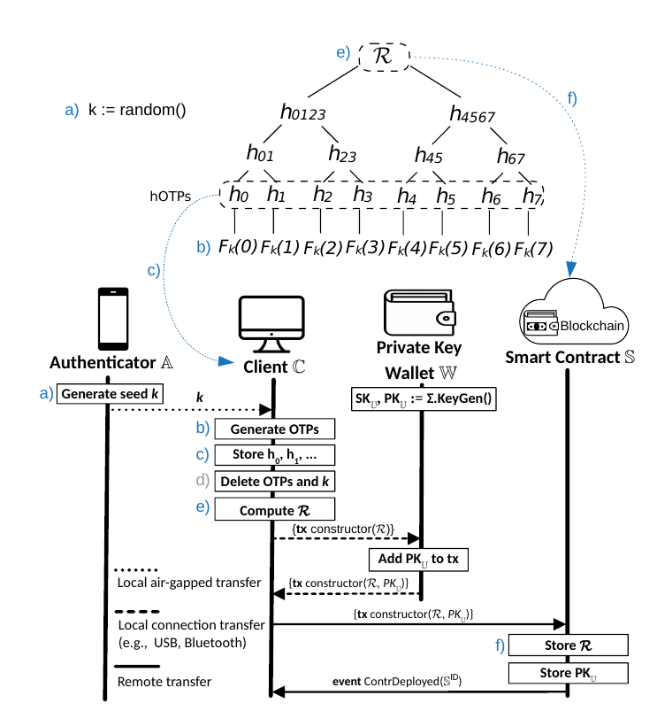

# SmartVault

### Motivation

### Background

[Contract accounts](https://ethdocs.org/en/latest/contracts-and-transactions/account-types-gas-and-transactions.html) provide multiple owners (such as [Gnosis multisig wallet](https://github.com/gnosis/MultiSigWallet)) to manage the wallets, and other safeguard measures. These type of wallets have been widely used in companies, and exchanges to secure large amount of funds.  For the retail user, there are many challenges with coordinating with other signers and usability with handling contract signings. 

Early 2021, the idea of social recovery wallet has been discussed (Vitalik [blog](https://vitalik.ca/general/2021/01/11/recovery.html)) with two commercial products Argent wallet, and Loopring wallet. Contract accounts traditionally been difficult to use due to need to have a native wallet with [External Owned Account](https://ethdocs.org/en/latest/contracts-and-transactions/account-types-gas-and-transactions.html) to sign transactions & pay for the fees. To much credits to Argent & Loopring, they introduced **relayers** to subsidize and defer fees to the contract, therefore eliminating the need for an External Owned Account.

However, most users have difficulty asking or trust someone else to be an authorized member of the wallet, so it is no surprise that the default recovery offered by Argent and Loopring wallet are with email & SMS. Argent & Loopring become the default recovery signer on behalf of the user when the email & SMS are verified. The approach puts a large burden on the companies to safeguard it like a centralized exchange, and risks to all the users if those servers and/or the signer key is compromised. On the client side, we have seen too many [email phishing](https://www.webroot.com/us/en/resources/tips-articles/what-is-phishing), [SIM swaps](https://en.wikipedia.org/wiki/SIM_swap_scam) to sensible defer wallet recovery to them.

Ivan Homoliak, et al proposed a novel solution in [SmartOTPs: An Air Gapped 2-Factor Authentication Smart-Contract Wallet (AFT'20)](https://arxiv.org/pdf/1812.03598.pdf), which shows [Merkle Tree](https://en.wikipedia.org/wiki/Merkle_tree) can be used to verify the posession of the correct OTP code at the given counter, and the original OTP secret. Essentially all the OTPs are hashed, and stored at the client. 1) The root hash is stored on the contract. 2) The client sends the current OTP, and the merkle proof (the hashes in the chain to compute to root). 3) The smart contract hashes the OTP, along with the merkle proof to validate that the root is the same thereby providing the user has the correct OTP, and secret.



Ivan's implementation uses a custom Authenticator capable of generating OTP in form of mnemnic words and providing 128bits entropy. This is an important point to remember as our design calls for widely used Google Authenticator (GA). 

Google spends R&D to develop the most secure, and user friendly Authenticator. It is no suprise many companies and individual come to trust it for their 2FA OTP client. GA has its [limitations](https://labanskoller.se/blog/2019/07/11/many-common-mobile-authenticator-apps-accept-qr-codes-for-modes-they-dont-support/), and among them is that it can only provide 6 digits OTP code with a mere 10^6, 1 million combinations.  Any hash derived generated from these 6 digits can be brute forced in 0.000056 seconds ([Benchmark](https://github.com/siseci/hashcat-benchmark-comparison/blob/master/4x%20Nvidia%20GTX%201080%20TI%20Hashcat%20Benchmark)).  Prefixing a salt does not increase entropy and forces the salt be kept as a secret in order to generate new hashes.
 
We only consider using the OTP codes to be used for recovery purposes and authorize privileged transactions. Therefore, we can assume it be used less often, perhaps 2-3x a year. This approach allows us to expand the number of consecutive OTP codes to 5 or more without sacrificing usability. Five consecutive codes results in 10^30 or 100bits+ entropy. On a 4x Nvidia GTX 1080 TI Hashcat, SHA256 can be hashed at 2^22/sec. To caculate the time it takes to brute-force 100bits entropy:  2^100 / 2 ^22 = 2^78  / 31556952 secs per year = 9.5 x 10^15 years. 

### Specifications

#### Counterfactual Wallet Creation

Counterfactual wallet can be created with [CREATE2](https://eips.ethereum.org/EIPS/eip-1014#motivation[EIP]) which enables us to compute the wallet address of your contract, deposit funds, then deploy the contract. This approach enables SmartVault wallet without owning any native wallet, making it accessible for millions of Harmony exchange-only users.

```
function computeWalletAddress(
    address owner,
    uint    salt
    )
    public
    view
    returns (address)
{
    return Create2.computeAddress(
        keccak256(abi.encodePacked(WALLET_CREATION, owner, salt)),
        getWalletCode()
    );
}

function _deploy(
    address owner,
    uint    salt
    )
    internal
    returns (address payable wallet)
{
    // Deploy the wallet proxy
    wallet = Create2.deploy(
        keccak256(abi.encodePacked(WALLET_CREATION, owner, salt)),
        getWalletCode()
    );
}
```

#### Relayer & Meta-transactions

We expect the user to be an exchange user who does not have access to a native wallet. Even so for native wallet user, it is too cumbersome to setup the signing wallet and often requiring on be on desktop machine. The relayer is designed to take a signed tx from the client, and forward it the blockchain and get refunded when the transaction is successful.

```
function executeMetaTx(
        bytes   calldata data,
        bytes   calldata signatures, 
        uint256 nonce,
        uint256 gasPrice,
        uint256 gasLimit,
        address refundToken,
        address payable refundAddress            
    ) external 
```

#### Storing Merkle Hashes on IPFS

The client requires to store the merkle when a wallet recovery, or privileged transaction is called. These hashes will be lost when the user machine is inaccessible or wallet is deleted. Since our merkle hashes are strong, and can be safely stored anywhere, we can make the recovery process even easier by storing these hashes on IPFS.

```
function setHashStorageId(string calldata id) external  onlyFromWalletOrOwnerWhenUnlocked()  {
    wallet.hashStorageID = id;
}
```


#### Contract Upgradability

Upgradeable contract makes it convenient for users to get the latest bug fixes, and features without having to transfer fund to a new contract or address. We use the widely used Proxy from [Gnosis Safe Proxy]( https://github.com/gnosis/safe-contracts/blob/development/contracts/proxies/GnosisSafeProxy.sol)

```
function upgradeMasterCopy(address newMasterCopy) external onlySelf() {
    masterCopy = newMasterCopy;
    emit WalletUpgraded(newMasterCopy);
}
```

#### Citations
